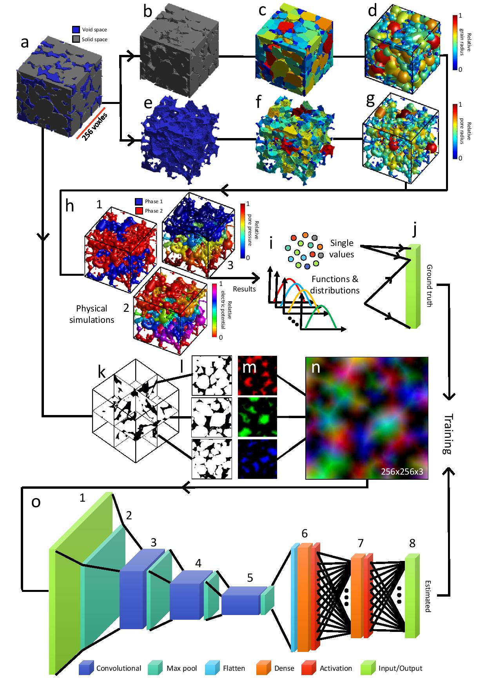
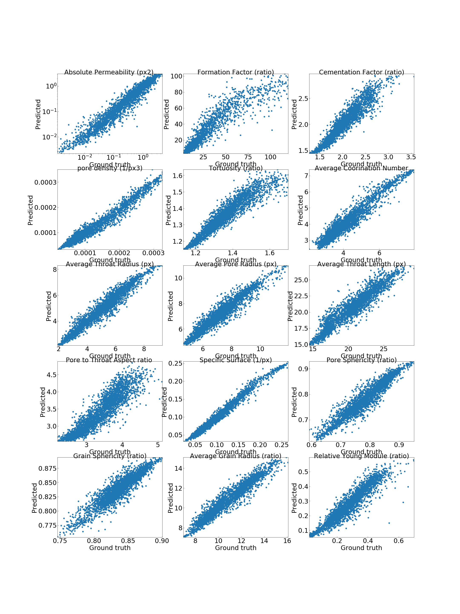

# DeePore: Deep learning for rapid characterization of porous materials
## Summary
DeePore is a deep learning workflow for rapid estimation of a wide range of porous material properties based on the binarized micro-tomography images. We generated 17700 semi-real 3-D micro-structures of porous geo-materials and 30 physical properties of each sample are calculated using physical simulations on the corresponding pore network models. The dataset of porous material images obtained and physical features of them are unprecedented in terms of the number of samples and variety of the extracted features. Next, a re-designed feed-forward convolutional neural network is trained based on the dataset to estimate several morphological, hydraulic, electrical, and mechanical characteristics of porous material in a fraction of a second. The average coefficient of determination (R2) for 3173 testing samples is 0.9385 which is very reasonable considering the wide range of micro-structure textures and extracted features. This workflow is compatible with any physical size of the images due to its dimensionless approach. 

The present repository is corresponded to this published paper: 

Arash Rabbani, Reza Shams and Masoud Babaei, DeePore: a deep learning workflow for rapid and comprehensive characterization of porous materials, arXiv:2005.03759v1 [cond-mat.mtrl-sci], 3 May 2020.
<br/>[Link to the paper](https://arxiv.org/abs/2005.03759)

<br/> Here, is a visual summary of data workflow in DeePore to make the ground truth data and train the model: 
<br/>[]()

Figure 1. DeePore data workflow for generating the ground truth data and training the CNN based on that, original binary
geometry (a), solid and void spaces (b and e), labeld map of nodes (c and f), solid and pore network models (d and g), some of
physical simulations on the pore network (h1 to h3), calculated single{value features, as well as the functions and distributions
(i), 
atten array of ground truth data (j), three perpendicular mid-planes out of the 3-D volumetric data (k), structure of three
selected planes with one as solid and zero as void space (l), normalized three distance maps of the solid space which mimics
red, green, and blue channels of a synthetic RGB image (m), input feature map of the porous media as a fictitious RGB image
(n), (o) structure of the designed CNN with 8 layers each of which described in the table below.


The output of this model is an array with 1515 elements that are described in this table:
|  Output indices  |                 Value (unit)                 |
|:----------------:|:--------------------------------------------:|
|         1        |         Absolute Permeability (px2)          |
|         2        |           Formation Factor (ratio)           |
|         3        |          Cementation Factor (ratio)          |
|         4        |             pore density (1/px3)             |
|         5        |              Tortuosity (ratio)              |
|         6        |          Average Coorination Number          |
|         7        |          Average Throat Radius (px)          |
|         8        |           Average Pore Radius (px)           |
|         9        |          Average Throat Length (px)          |
|        10        |         Pore to Throat Aspect ratio          |
|        11        |            Specific Surface (1/px)           |
|        12        |            Pore Sphericity (ratio)           |
|        13        |           Grain Sphericity (ratio)           |
|        14        |         Average Grain Radius (ratio)         |
|        15        |         Relative Young Module (ratio)        |
|      16-115      |          Leveret J Function (ratio)          |
|     116 - 215    |   Wetting Relative Permeability (fraction)   |
|     216 - 315    | Non-Wetting Relative Permeability (fraction) |
|     316 - 415    |     Two-point Correlation Function (1/px)    |
|     416 - 515    |         Pore Radius Distribution (px)        |
|     516 - 615    |        Throat Radius Distribution (px)       |
|     616 - 715    |        Throat Lenght Distribution (px)       |
|     716 - 815    |    Pore Inscribed Radius Distribution (px)   |
|     816 - 915    |   Throat Inscribed Radius Distribution (px)  |
|    916 - 1015    |         Throat Average Distance (px)         |
|    1016 - 1115   |    Throat Permeability Distribution (px2)    |
|    1116 - 1215   |       Coordination Number Distribution       |
|    1216 - 1315   |     Pore Sphericity Distribution (ratio)     |
|    1316 - 1415   |     Grain Sphericity Distribution (ratio)    |
|    1416 - 1515   |        Grain Radius Distribution (px)        |

## Dataset of 17700 semi-realistic porous material images
You can download the whole data set with extracted properties of porous material images from this [Link](https://zenodo.org/record/3820900#.Xrnpr2hKjDc).
However, if you run the codes, file will be downloaded automatically if you wish, and it will skip downloading if you have already downloaded the dataset.

Here are 1500 of them to see how textures look like:
<br />
<br />
[](https://www.youtube.com/watch?v=bViDVbmjvK4)


## Example

```python
import DeePore as dp
DataName='DeePore_Compact_Data.h5'
dp.check_get('https://www.linktodata',DataName)               
List,MIN,MAX=dp.prep(DataName)
TrainList, EvalList, TestList = dp.splitdata(List)
model=dp.trainmodel(DataName,TrainList,EvalList,MIN,MAX,retrain=0)  
#  Now Testing the Model on the test samples
dp.testmodel(model,DataName,TestList,MIN,MAX)

```
This is the testing result for around 3000 sample images
[]()