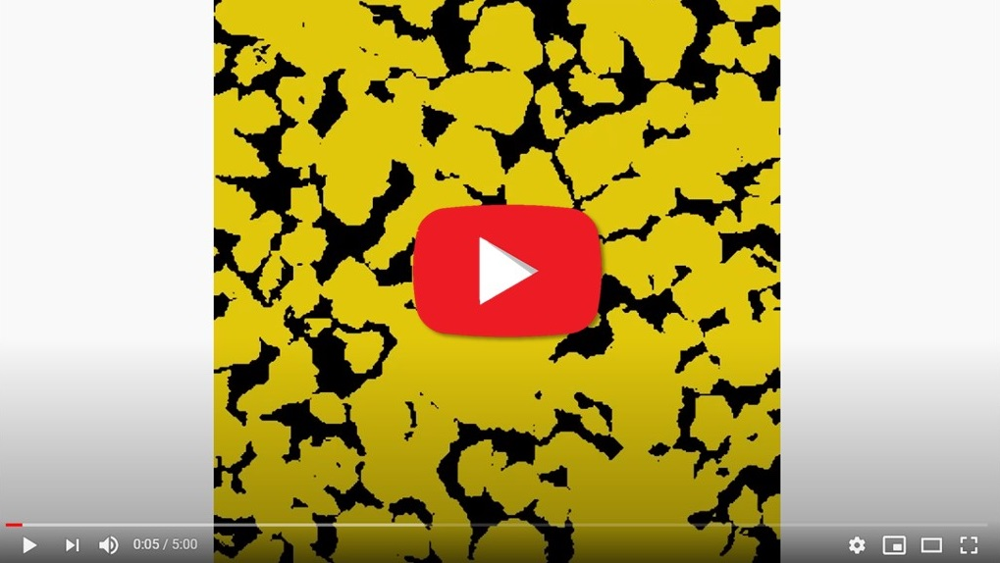

# DeePore: Deep learning for rapid characterization of porous materials
## Summary
DeePore is a deep learning workflow for rapid estimation of a wide range of porous material properties based on the binarized micro-tomography images. We generated 17700 semi-real 3-D micro-structures of porous geo-materials and 30 physical properties of each sample are calculated using physical simulations on the corresponding pore network models. The dataset of porous material images obtained and physical features of them are unprecedented in terms of the number of samples and variety of the extracted features. Next, a re-designed feed-forward convolutional neural network is trained based on the dataset to estimate several morphological, hydraulic, electrical, and mechanical characteristics of porous material in a fraction of a second. The average coefficient of determination (R2) for 3173 testing samples is 0.9385 which is very reasonable considering the wide range of micro-structure textures and extracted features. This workflow is compatible with any physical size of the images due to its dimensionless approach. 

## Dataset of 17700 semi-realistic porous material images
Here are 1500 of them to see how textures look like:
<br />
[](https://www.youtube.com/watch?v=bViDVbmjvK4)


## Example

```python
import DeePore as dp
DataName='DeePore_Compact_Data.h5'
dp.check_get('https://www.linktodata',DataName)               
List,MIN,MAX=dp.prep(DataName)
TrainList, EvalList, TestList = dp.splitdata(List)
model=dp.trainmodel(DataName,TrainList,EvalList,MIN,MAX,retrain=0)  
#  Now Testing the Model on the test samples
dp.testmodel(model,DataName,TestList,MIN,MAX)

```