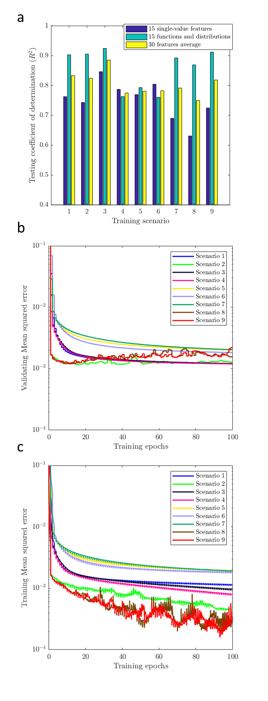
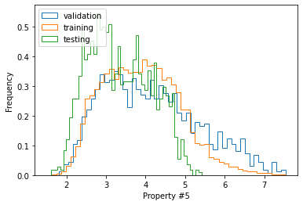

# DeePore: Deep learning for rapid characterization of porous materials


## Summary

DeePore  is a deep learning workflow for rapid estimation of a wide range of porous material properties based on the binarized micro–tomography images. By combining naturally occurring porous textures we generated 17,700 semi–real 3–D micro–structures of porous geo–materials with size of 256^3 voxels and 30 physical properties of each sample are calculated using physical simulations on the corresponding pore network models. Next, a designed feed–forward convolutional neural network (CNN) is trained based on the dataset to estimate several morphological, hydraulic, electrical, and mechanical characteristics of the porous material in a fraction of a second. In order to fine–tune the CNN design, we tested 9 different training scenarios and selected the one with the highest average coefficient of determination (*R*2) equal to 0.885 for 1418 testing samples. Additionally, 3 independent synthetic images as well as 3 realistic tomography images have been tested using the proposed method and results are compared with pore network modelling and experimental data, respectively. Tested absolute permeabilities had around 13% relative error compared to the experimental data which is noticeable considering the accuracy of the direct numerical simulation methods such as Lattice Boltzmann and Finite Volume. The workflow is compatible with any physical size of the images due to its dimensionless approach and can be used to characterize large–scale 3–D images by averaging the model outputs for a sliding window that scans the whole geometry.


The present repository is corresponded to this published paper: 

Rabbani, A., Babaei, M., Shams, R., Da Wang, Y., & Chung, T. (2020). DeePore: a deep learning workflow for rapid and comprehensive characterization of porous materials. *Advances in Water Resources*, *146*, 103787.
<br/>[Link to the paper on arxiv](https://arxiv.org/abs/2005.03759)

[Link to the paper on sciencedirect](https://www.sciencedirect.com/science/article/pii/S0309170820304590)

The required packages to use this python repository are: 'numpy', 'scipy', 'h5py', 'tensorflow', 'matplotlib', 'cv2', and 'urllib'. I recommend to use Anaconda which has all these packages installed except cv2 and tensorflow of which you can easily install from pip.

Additionally on Demo#4 for improving training time of different scenarios 'joblib' parallel computing library is used but you can skip it if not planning to use parallelization.

<br/> Here, is a visual summary of data workflow in DeePore to make the ground truth data and train the model: 
<br/>[]()

Figure 1. DeePore data workflow for generating the ground truth data and training the CNN based on that, original binary
geometry (a), solid and void spaces (b and e), labeled map of nodes (c and f), solid and pore network models (d and g), some of
physical simulations on the pore network (h1 to h3), calculated single{value features, as well as the functions and distributions
(i), flatten array of ground truth data (j), three perpendicular mid-planes out of the 3-D volumetric data (k), structure of three
selected planes with one as solid and zero as void space (l), normalized three distance maps of the solid space which mimics
red, green, and blue channels of a synthetic RGB image (m), input feature map of the porous media as a fictitious RGB image
(n), (o) structure of the designed CNN with 8 layers each of which described in the paper.


The output of this model is an array with 1515 elements that are described in this table:
| Output indices |                 Value (unit)                 |
| :------------: | :------------------------------------------: |
|       1        |         Absolute Permeability (px2)          |
|       2        |           Formation Factor (ratio)           |
|       3        |          Cementation Factor (ratio)          |
|       4        |             pore density (1/px3)             |
|       5        |              Tortuosity (ratio)              |
|       6        |         Average Coordination Number          |
|       7        |          Average Throat Radius (px)          |
|       8        |           Average Pore Radius (px)           |
|       9        |          Average Throat Length (px)          |
|       10       |         Pore to Throat Aspect ratio          |
|       11       |           Specific Surface (1/px)            |
|       12       |           Pore Sphericity (ratio)            |
|       13       |           Grain Sphericity (ratio)           |
|       14       |         Average Grain Radius (ratio)         |
|       15       |        Relative Young Module (ratio)         |
|     16-115     |          Leveret J Function (ratio)          |
|   116 - 215    |   Wetting Relative Permeability (fraction)   |
|   216 - 315    | Non-Wetting Relative Permeability (fraction) |
|   316 - 415    |    Two-point Correlation Function (1/px)     |
|   416 - 515    |        Pore Radius Distribution (px)         |
|   516 - 615    |       Throat Radius Distribution (px)        |
|   616 - 715    |       Throat Lenght Distribution (px)        |
|   716 - 815    |   Pore Inscribed Radius Distribution (px)    |
|   816 - 915    |  Throat Inscribed Radius Distribution (px)   |
|   916 - 1015   |         Throat Average Distance (px)         |
|  1016 - 1115   |    Throat Permeability Distribution (px2)    |
|  1116 - 1215   |       Coordination Number Distribution       |
|  1216 - 1315   |     Pore Sphericity Distribution (ratio)     |
|  1316 - 1415   |    Grain Sphericity Distribution (ratio)     |
|  1416 - 1515   |        Grain Radius Distribution (px)        |

## Dataset of 17700 semi-realistic porous material images
You can download the whole data set with extracted properties of porous material images from this [Link](https://zenodo.org/record/3820900#.Xrnpr2hKjDc) on Zenodo data repository. However, if you run the codes, file will be downloaded automatically if you wish, and it will skip downloading if you have already downloaded the dataset. Dataset files are in HDF format, I have put some examples in demo py files how to read and import them as regular numpy arrays. On the repository we have two HDF files with the extension of 'h5'.  The compact dataset is just for retraining and ANN structure tuning, and it contains max-pooled distance maps with the size of  3x128x128 as input. So, you are not able to see the original images using this data file. But if you get the complete dataset which is around 12 Gb, you will have all 3-D structures of augmented porous images with the size of 256^3 plus all extracted features. 

These images are created by some data augmentation techniques that are described in the paper if you are interested. 

Then all the features are extracted for each of the images using some classic image processing and simulation techniques such as pore network modeling. 

Here are 1500 of them to see how textures look like: different colors are just for fun!
<br />
<br />
<a href="https://www.youtube.com/watch?v=bViDVbmjvK4">
</a>
<br />

now lets dive into the code to see how to use it. I have made 5 demo files to demonstrate different tasks. 

## Demo #1

In this demo file we read a 2-D or 3-D image of porous material and use the pre-trained ANN to predict its physical properties. Explanations are provided line by line within the code. The final properties are saved as a text file in your working directory. 

At the end of the file, you see some compatibility options that shows you can import different types of images and data formats such as mat files, png, jpg and even gray-scale images. Otsu algorithm will be used to threshold the gray-scale images.  

```python
import DeePore as dp
# Part #1    A quick start 
# Feed your porous material image to see its properties predicted 
# 1. load the trained model
model=dp.loadmodel()
# 2. read and transform your data into initial feature maps
# in this example, the data is a 400 x 400 x 400 binary MATLAB mat file in which 0 indicates void and 1 indicates solid space
A=dp.feedsampledata(FileName="Data/Sample_large.mat")
# 3. show feature maps (optional)
dp.show_feature_maps(A)
# 4. predict properties
all_preds=dp.predict(model,A,res=4.8) # res is the spatial resolution of image in micron/pixel
# 5. save results into a text file and also print it in console
dp.prettyresult(all_preds,'results.txt')


# Part #2    Compatibility
# 1. you can try to load numpy 3-d arrays with the same manner
A=dp.feedsampledata(FileName="Data/Sample.npy")
# 2. also 2-d images with formats of jpg and png are welcome
# if you import a 2-d image, the code creates 3 arbitrary mid-slices by flipping the 2-d image
A=dp.feedsampledata(FileName="Data/Sample.jpg")
A=dp.feedsampledata(FileName="Data/Sample.png")
# 3. when your image is larger than 256 x 256 x 256, the code automatically consider sliding windows to cover the whole image and report back to you the averaged predictions
A=dp.feedsampledata(FileName="Data/Sample_large.mat")
# when the data is loaded and transformed to the initial feature maps using this function, you are good to go and find its properties as shown above.


```

This is the initial feature maps created for 400 x 400 x 400 voxels MATLAB mat file image of porous sandstone which are used as inputs to the DeePore model to predict an averaged set of physical properties. 
These maps are created by moving a sliding window of 256 x 256 x 256 voxels over the entire image. These image do not have explicit physical meaning but they are used as the input of our developed CNN to predict porous material properties. 
[]()

And this is part of the predicted data in the text file for mat file image which is a Berea sandstone which is a famous sample from Imperial Collage repo: 

[Link to Berea repo](https://figshare.com/authors/_Imperial_College_Consortium_on_Pore_scale_Modelling/553413)

```
        ### Single-value parameters ###
__________________________________________________

Properties                              Value
--------------------------------------------------
absolute Permeability (um2)             1.2828239
Formation Factor (ratio)                26.9038139
Cementation Factor (ratio)              2.3059768
pore density (1/um3)                    1.6e-06
Tortuosity (ratio)                      1.4210381
Average Coordination Number             3.2719543
Average Throat Radius (um)              17.3087101
Average Pore Radius (um)                27.4299851
Average Throat Length (um)              81.1651871
Pore to Throat Aspect ratio             4.1648017
Specific Surface (1/um)                 2.1e-05
Pore Sphericity (ratio)                 2.7744169
Grain Sphericity (ratio)                0.8168038
Average Grain Radius (um)               44.3641144
Relative Young Module (ratio)           0.2033347
```

## Demo #2

In this demo you are able to retrain the ANN using the compact version of the dataset and try your own structure by editing the 'trainmodel' function. Finally the trained model is tested across the test samples. We have tried 9 difference model types and model type #3 was the best in performance and stability. 

'trainmodel' function does have a retrain input and if you pass zero it will load the pre-trained network. batch size of 100 seems to be working for the current settings. 

```python
import DeePore as dp
# Retrain and test the model: 
# If you want to try you own architecture of neural network or retrain the present one
# 1. check or download the compact data
Data_compact='Data\DeePore_Compact_Data.h5'
dp.check_get('https://zenodo.org/record/4297035/files/DeePore_Compact_Data.h5?download=1',Data_compact) 

# 2. prepare the dataset by removing outliers and creating list of training, evaluation and test samples
List=dp.prep(Data_compact)
TrainList, EvalList, TestList = dp.splitdata(List)
# 3. retrain the model
model=dp.trainmodel(Data_compact,TrainList,EvalList,retrain=0,epochs=50,batch_size=100,ModelType=3)  
# 4. test the model
dp.testmodel(model,Data_compact,TestList)

```

This is the testing result for around 3000 sample images
[]()

## Demo #3

In this demo we download the original dataset, visualize one of the entries and print out the recorded features in the dataset. you can use the images and the extracted features for your own tailored machine learning workflow. 

```python
import DeePore as dp
# Explore the dataset: 
# If you want to open images of dataset and visualize them
# 1. check or download the complete dataset 
Data_complete='Data\DeePore_Dataset.h5'
dp.check_get('https://zenodo.org/record/4297035/files/DeePore_Dataset.h5?download=1',Data_complete)
# 2. read the first image out of 17700
A=dp.readh5slice(Data_complete,'X',[0]) 
# 3. show mid-slices of the loaded image
dp.showentry(A)
# 4. show and save the properties of this image which assumed to be the ground truth as text file
props=dp.readh5slice(Data_complete,'Y',[0])
dp.prettyresult(props,'sample_gt.txt',units='px')
```
Here is the 3 mid-planes of the first 3-D image of the dataset
[]()

And part of the ground-truth properties from the saved text file:
```
        ### Single-value parameters ###
__________________________________________________

Properties                              Value
--------------------------------------------------
Absolute Permeability (px2)             0.0321214
Formation Factor (ratio)                16.9433861
Cementation Factor (ratio)              1.9621598
pore density (1/px3)                    0.0002908
Tortuosity (ratio)                      1.2430909
Average Coordination Number             4.742775
Average Throat Radius (px)              2.673661
Average Pore Radius (px)                5.13837
Average Throat Length (px)              15.4859619
Pore to Throat Aspect ratio             3.565485
Specific Surface (1/px)                 0.1543706
Pore Sphericity (ratio)                 0.6998004
Grain Sphericity (ratio)                0.8364815
Average Grain Radius (px)               8.2932272
Relative Young Module (ratio)           0.3068074
```

## Demo #4

In this demo we try to examine different training strategies to fine tune the model in a parallelized manner. So, we have put 9 different model types in the deepore main py file and you can try each of them to see the best one. Also, you can replace them with yours to see if improvements can be made. details of different training scenarios in terms of loss functions and network structure are provided in the paper linked above.  

```python
import DeePore as dp

# Comparing different model architectures: 
# 1. check or download the compact data
Data_compact='Data\DeePore_Compact_Data.h5'
dp.check_get('https://zenodo.org/record/4297035/files/DeePore_Compact_Data.h5?download=1',Data_compact) 
# 2. prepare the dataset by removing outliers and creating list of training, evaluation and test samples
List=dp.prep(Data_compact)

# 3. shuffling the dataset
List=dp.shuf(List)

# List=List[1:1000]     #uncomment for a smaller dataset for test purposes
TrainList, EvalList, TestList = dp.splitdata(List)

# 4. defining the training and testing workflows
def calc(I):
    model=dp.trainmodel(Data_compact,TrainList,EvalList,retrain=1,epochs=100,batch_size=100,ModelType=I)  
    dp.testmodel(model,Data_compact,TestList,ModelType=I)

# 5. test different scenarios in parallel
import numpy as np
out=dp.parfor(calc,np.arange(1,10))
```

As the result, we have visualized the stats of different training scenarios and it seems that scenario #3 is the winner. That is the pretrained model I have put in the repo. 



## Demo #5

In order to see how similar or different are the training, validation and test data, we use the compact dataset to plot histograms of the extracted features.   

```python
import DeePore as dp
# Comparing statistics of the training, validation and testing data: 
# 1. check or download the compact data
Data_compact='Data\DeePore_Compact_Data.h5'
dp.check_get('https://zenodo.org/record/4297035/files/DeePore_Compact_Data.h5?download=1',Data_compact) 
# 2. prepare the dataset by removing outliers and creating list of training, validation and test samples
List=dp.prep(Data_compact)
TrainList, EvalList, TestList = dp.splitdata(List)

# 3. read datasets 'Y' into arrays
Data_Eval=dp.readh5slice(Data_compact,'Y',EvalList)
Data_Train=dp.readh5slice(Data_compact,'Y',TrainList)
Data_Test=dp.readh5slice(Data_compact,'Y',TestList)

# exporting to MATLAB for extra postprocessing if you needed
# import scipy.io as sio
# sio.savemat('All_Data.mat',{'train':Data_Train,'eval':Data_Eval,'test':Data_Test})
 
# 4. plot histograms
import matplotlib.pyplot as plt
FN=5 # feature id number, you can select 0 to 14
h=plt.hist(Data_Eval[:,FN,0],50,histtype='step',density=True,label='validation')
h=plt.hist(Data_Train[:,FN,0],50,histtype='step',density=True,label='training')
h=plt.hist(Data_Test[:,FN,0],50,histtype='step',density=True,label='testing')
plt.ylabel('Frequency')
plt.xlabel('Property #' +str(FN))
plt.legend(loc='upper left')

```

Here is the distribution of the feature number 6 which is the average coordination number among training, testing and validation sets.



Thank you very much everybody for time and patience :) , let me know if you have got problem implementing or running this repo.

rabarash@yahoo.com  