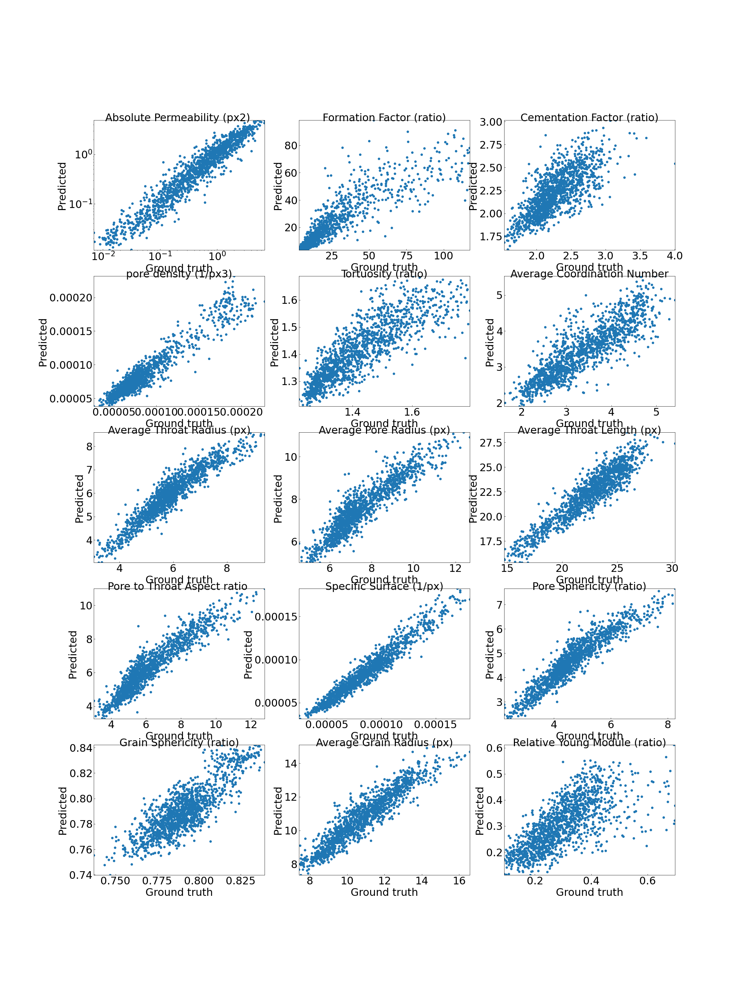

# DeePore: Deep learning for rapid characterization of porous materials
## Summary
DeePore is a deep learning workflow for rapid estimation of a wide range of porous material properties based on the binarized micro-tomography images. We generated 17700 semi-real 3-D micro-structures of porous geo-materials and 30 physical properties of each sample are calculated using physical simulations on the corresponding pore network models. The dataset of porous material images obtained and physical features of them are unprecedented in terms of the number of samples and variety of the extracted features. Next, a re-designed feed-forward convolutional neural network is trained based on the dataset to estimate several morphological, hydraulic, electrical, and mechanical characteristics of porous material in a fraction of a second. The average coefficient of determination (R2) for 3173 testing samples is 0.9385 which is very reasonable considering the wide range of micro-structure textures and extracted features. This workflow is compatible with any physical size of the images due to its dimensionless approach. 

The present repository is corresponded to this published paper: 

Arash Rabbani, Reza Shams and Masoud Babaei, DeePore: a deep learning workflow for rapid and comprehensive characterization of porous materials, arXiv:2005.03759v1 [cond-mat.mtrl-sci], 3 May 2020.
<br/>[Link to the paper](https://arxiv.org/abs/2005.03759)

The required packages to use this repo are: 'numpy', 'scipy', 'h5py', 'tensorflow', 'matplotlib', 'cv2', and 'urllib'. I recommend to use Anaconda which has all these packages installed except cv2 and tensorflow of which you can easily install from pip.
<br/> Here, is a visual summary of data workflow in DeePore to make the ground truth data and train the model: 
<br/>[]()

Figure 1. DeePore data workflow for generating the ground truth data and training the CNN based on that, original binary
geometry (a), solid and void spaces (b and e), labeld map of nodes (c and f), solid and pore network models (d and g), some of
physical simulations on the pore network (h1 to h3), calculated single{value features, as well as the functions and distributions
(i), 
atten array of ground truth data (j), three perpendicular mid-planes out of the 3-D volumetric data (k), structure of three
selected planes with one as solid and zero as void space (l), normalized three distance maps of the solid space which mimics
red, green, and blue channels of a synthetic RGB image (m), input feature map of the porous media as a fictitious RGB image
(n), (o) structure of the designed CNN with 8 layers each of which described in the table below.


The output of this model is an array with 1515 elements that are described in this table:
|  Output indices  |                 Value (unit)                 |
|:----------------:|:--------------------------------------------:|
|         1        |         Absolute Permeability (px2)          |
|         2        |           Formation Factor (ratio)           |
|         3        |          Cementation Factor (ratio)          |
|         4        |             pore density (1/px3)             |
|         5        |              Tortuosity (ratio)              |
|         6        |          Average Coorination Number          |
|         7        |          Average Throat Radius (px)          |
|         8        |           Average Pore Radius (px)           |
|         9        |          Average Throat Length (px)          |
|        10        |         Pore to Throat Aspect ratio          |
|        11        |            Specific Surface (1/px)           |
|        12        |            Pore Sphericity (ratio)           |
|        13        |           Grain Sphericity (ratio)           |
|        14        |         Average Grain Radius (ratio)         |
|        15        |         Relative Young Module (ratio)        |
|      16-115      |          Leveret J Function (ratio)          |
|     116 - 215    |   Wetting Relative Permeability (fraction)   |
|     216 - 315    | Non-Wetting Relative Permeability (fraction) |
|     316 - 415    |     Two-point Correlation Function (1/px)    |
|     416 - 515    |         Pore Radius Distribution (px)        |
|     516 - 615    |        Throat Radius Distribution (px)       |
|     616 - 715    |        Throat Lenght Distribution (px)       |
|     716 - 815    |    Pore Inscribed Radius Distribution (px)   |
|     816 - 915    |   Throat Inscribed Radius Distribution (px)  |
|    916 - 1015    |         Throat Average Distance (px)         |
|    1016 - 1115   |    Throat Permeability Distribution (px2)    |
|    1116 - 1215   |       Coordination Number Distribution       |
|    1216 - 1315   |     Pore Sphericity Distribution (ratio)     |
|    1316 - 1415   |     Grain Sphericity Distribution (ratio)    |
|    1416 - 1515   |        Grain Radius Distribution (px)        |

## Dataset of 17700 semi-realistic porous material images
You can download the whole data set with extracted properties of porous material images from this [Link](https://zenodo.org/record/3820900#.Xrnpr2hKjDc) on Zenodo data repository.
However, if you run the codes, file will be downloaded automatically if you wish, and it will skip downloading if you have already downloaded the dataset.

Here are 1500 of them to see how textures look like:
<br />
<br />
<a href="https://www.youtube.com/watch?v=bViDVbmjvK4">
</a>
## Demo #1

```python
import DeePore as dp
# Quick start: 
# Feed your porous material image to see its properties predicted 
# 1. load the trained model
model=dp.loadmodel()
# 2. read and transform your data into initial feature maps
# in this example, the data is a 400 x 400 x 400 binary MATLAB mat file in which 0 indicates void and 1 indicates solid space
A=dp.feedsampledata(FileName="Data/Sample_large.mat")
# 3. show feature maps (optional)
dp.show_feature_maps(A)
# 4. predict properties
all_preds=dp.predict(model,A,res=4.8) # res is the spatial resolution of image in micron/pixel
# 5. save results into a text file and also print it in console
dp.prettyresult(all_preds,'results.txt')
# Compatibility
# 1. you can try to load numpy 3-d arrays with same manner
A=dp.feedsampledata(FileName="Data/Sample.npy")
# 2. also 2-d images with formats of jpg and png are welcome
# if you import a 2-d image, the code creates 3 arbitrary mid-slices by flipping the 2-d image
A=dp.feedsampledata(FileName="Data/Sample.jpg")
A=dp.feedsampledata(FileName="Data/Sample.png")
# 3. when your image is larger than 256 x 256 x 256, the code automatically consider sliding windows to cover the whole image and report back to you the averaged predictions
A=dp.feedsampledata(FileName="Data/Sample_large.mat")
# when the data is loaded and transformed to the initial feature maps using this function, you are good to go and find its properties as shown above.

```
This is the intial feature maps created for 400 x 400 x 400 MATLAB mat file image of porous sandstone which are used as inputs to the DeePore model to predict an averaged set of physical properties. These maps are created by moving a sliding window of 256 x 256 x 256 over the entire image.
[]()


<br/>

And this is part of the predicted data in the text file for mat file image which is a Berea sandstone:

```
        ### Single-value parameters ###
__________________________________________________

Properties                              Value
--------------------------------------------------
Absolute Permeability (um2)             1.1405379
Formation Factor (ratio)                14.7386634
Cementation Factor (ratio)              1.9042206
pore density (1/um3)                    1.7e-06
Tortuosity (ratio)                      1.2443834
Average Coordination Number             4.478728
Average Throat Radius (um)              15.0556575
Average Pore Radius (um)                26.9941965
Average Throat Length (um)              85.5445165
Pore to Throat Aspect ratio             3.4341114
Specific Surface (1/um)                 0.0254289
Pore Sphericity (ratio)                 0.7200877
Grain Sphericity (ratio)                0.8562742
Average Grain Radius (um)               45.2546802
Relative Young Module (ratio)           0.3019229
```

## Demo #2

```python
import DeePore as dp
# Retrain and test the model: 
# If you want to try you own architecture of neural network or retrain the present one
# 1. check or download the compact data
Data_compact='Data\DeePore_Compact_Data.h5'
dp.check_get('https://zenodo.org/record/3820900/files/DeePore_Compact_Data.h5?download=1',Data_compact) 
# 2. prepare the dataset by removing outliers and creating list of training, evaluation and test samples
List=dp.prep(Data_compact)
TrainList, EvalList, TestList = dp.splitdata(List)
# 3. retrain the model
model=dp.trainmodel(Data_compact,TrainList,EvalList,retrain=0,epochs=100,batch_size=100)  
# 4. test the model
dp.testmodel(model,Data_compact,TestList)
```

This is the testing result for around 3000 sample images
[]()

## Demo #3

```python
import DeePore as dp
# Explore the dataset: 
# If you want to open images of dataset and visualize them
# 1. check or download the complete dataset 
Data_complete='Data\DeePore_Dataset.h5'
Data_complete='..\..\..\BigData\DeePore\DeePore_Dataset.h5'
dp.check_get('https://zenodo.org/record/3820900/files/DeePore_Dataset.h5?download=1',Data_complete)
# 2. read the first image out of 17700
A=dp.readh5slice(Data_complete,'X',[0]) 
# 3. show mid-slices of the loaded image
dp.showentry(A)
# 4. show and save the properties of this image which assumed to be the ground truth as text file
props=dp.readh5slice(Data_complete,'Y',[0])
dp.prettyresult(props,'sample_gt.txt',units='px')
```
Here is the 3 mid-planes of the first 3-D image of the dataset
[]()

And part of the ground-truth properties from the saved text file:
```
        ### Single-value parameters ###
__________________________________________________

Properties                              Value
--------------------------------------------------
Absolute Permeability (px2)             0.0321214
Formation Factor (ratio)                16.9433861
Cementation Factor (ratio)              1.9621598
pore density (1/px3)                    0.0002908
Tortuosity (ratio)                      1.2430909
Average Coordination Number             4.742775
Average Throat Radius (px)              2.673661
Average Pore Radius (px)                5.13837
Average Throat Length (px)              15.4859619
Pore to Throat Aspect ratio             3.565485
Specific Surface (1/px)                 0.1543706
Pore Sphericity (ratio)                 0.6998004
Grain Sphericity (ratio)                0.8364815
Average Grain Radius (px)               8.2932272
Relative Young Module (ratio)           0.3068074
```

